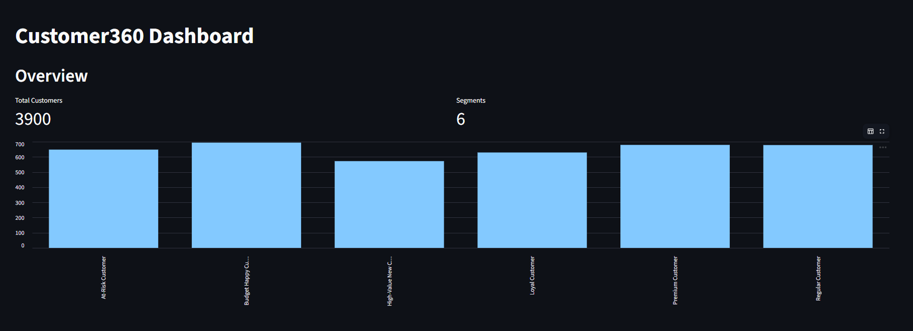
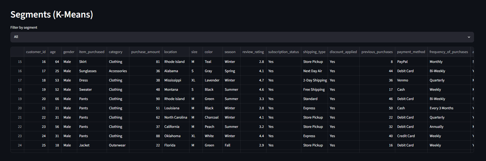
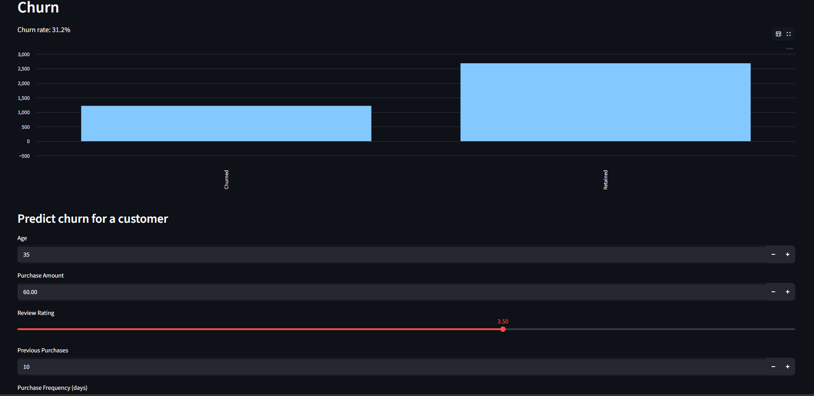
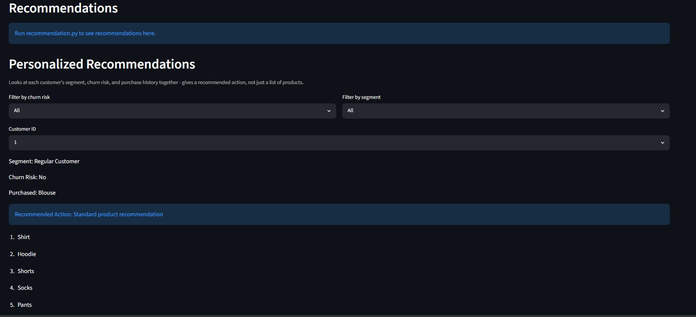
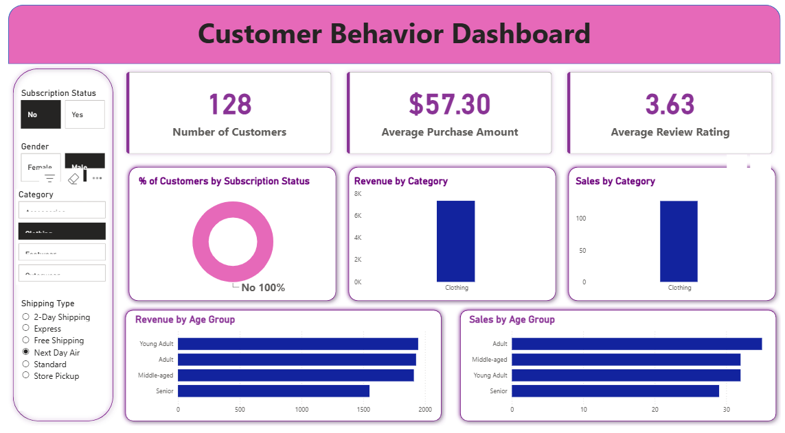

# Customer360

# Customer360 — Customer Intelligence Platform


An end-to-end pipeline that turns raw customer shopping behavior into three
things a business can act on: **who your customers are** (segmentation),
**who's about to leave** (churn prediction), and **what to offer each of
them** (personalized recommendations) — backed by a shared SQL layer that
feeds both a Power BI dashboard and a live Streamlit app.

**[Live Demo](https://arwcxhrpentxefuhrpbjtq.streamlit.app/)** &nbsp;•&nbsp; **[Power BI Dashboard](PASTE_LINK_HERE)** &nbsp;•&nbsp; **[Business Report](docs/Customer360_Bottleneck_Business_Report.docx)**


---

## Overview

| Component | What it does |
|---|---|
| **Segmentation** | K-Means clustering groups customers into 6 behavioral segments (Premium, Loyal, At-Risk, etc.) |
| **Churn Prediction** | Random Forest flags customers likely to leave, using a business-rule risk score |
| **Personalized Recommendation** | Combines segment + churn risk + purchase history to recommend products *and* a next action |
| **SQL Layer** | 19 business questions answered in SQL, shared by Power BI and Streamlit |
| **Streamlit App** | Live internal dashboard — segments, churn predictor, recommendations, embedded Power BI, SQL query panel |
| **Power BI Dashboard** | Stakeholder-facing report on revenue, categories, and customer segments |

## Architecture


Raw data is cleaned once, loaded into a shared SQL database, and every other
tool — the ML pipeline, Power BI, and Streamlit — reads from and writes back
to that same table. One source of truth, not three disconnected copies.

## Screenshots

| Overview | Segmentation |
|---|---|
|  |  |

| Churn Prediction | Personalized Recommendations |
|---|---|
|  |  |

| SQL Query Panel | Power BI Dashboard |
|---|---|
|  |  |

## Tech Stack

- **Python** — pandas, scikit-learn, joblib
- **Machine Learning** — K-Means (segmentation), Random Forest (churn), TF-IDF + cosine similarity (recommendations)
- **SQL** — SQLite (local) / Postgres-compatible queries
- **Streamlit** — interactive dashboard
- **Power BI** — stakeholder reporting

## Project Structure

```
Customer360/
├── dataset/                  # raw data
├── notebooks/                # cleaning & EDA notebook
├── machine_learning/         # segmentation, churn, recommendation scripts
├── sql/                      # 19 business questions in SQL
├── powerbi/                  # customer_behavior_dashboard.pbix
├── streamlit/                # app.py - the live dashboard
├── docs/                     # screenshots, diagrams, demo gif, business report
├── processed_data/           # generated CSVs
├── model/                    # generated .pkl files
├── requirements.txt
├── architecture_diagram.png
├── LICENSE
└── README.md
```

## Getting Started

```bash
git clone https://github.com/ArjunMishra2104/Customer360.git
cd Customer360
pip install -r requirements.txt

python machine_learning/segmentation.py
python machine_learning/churn_prediction.py
python machine_learning/recommendation.py
python machine_learning/personalized_recommendation.py
python machine_learning/load_to_sql.py

python -m streamlit run streamlit/app.py
```

## Key Results

- **[X]** customers analyzed across **6** behavioral segments
- **[X]%** churn rate identified, representing **$[X]** in revenue at risk
- Churn model: **[X]%** accuracy, **[X]%** recall on held-out test data
- Personalized recommendation engine covers **[X]%** of the product catalog

## Business Problems Addressed

- **Silent customer attrition** — churn model flags at-risk customers before they're gone
- **Undifferentiated marketing** — segments let offers be tailored instead of one-size-fits-all
- **Missed personalization** — the recommendation engine suggests relevant products per customer
- **Fragmented reporting** — Power BI and Streamlit both read from one shared SQL source of truth

## Limitations & Next Steps

- Churn label is a business-rule proxy, not verified historical churn
- Recommendation engine is content-based, not yet using true collaborative filtering
- Pipeline currently runs manually — a scheduled job would keep everything always current

## License

MIT License — see [LICENSE](LICENSE) for details.

## Author

**Arjun Mishra** — [@ArjunMishra2104](https://github.com/ArjunMishra2104)
